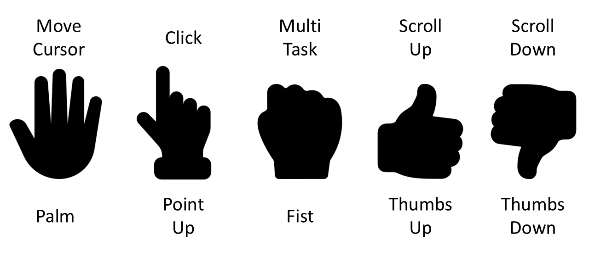

# Hand Gesture Control: Real-Time Mouse and Scroll Controller



## Table of Contents

- [Introduction](#introduction)
- [Features](#features)
- [Demo](#demo)
- [Installation](#installation)
- [Usage](#usage)
- [Gesture Controls](#gesture-controls)
- [Contributing](#contributing)
- [License](#license)
- [Acknowledgements](#acknowledgements)

## Introduction

Welcome to **Hand Gesture Control**, a real-time hand gesture recognition system that allows you to control your computer's mouse and scrolling functionalities using simple hand gestures. Leveraging **MediaPipe** for landmark detection, **TensorFlow** for gesture classification, and **PyAutoGUI** for automating mouse and keyboard actions, this project provides an intuitive and seamless way to interact with your computer without the need for traditional input devices.

## Features

- **Real-Time Gesture Recognition**: Detects and classifies hand gestures in real-time using your webcam.
- **Mouse Movement Control**: Move the mouse cursor smoothly across the screen based on hand movements.
- **Click Actions**: Perform mouse clicks with specific gestures.
- **Smooth Scrolling**: Scroll up and down smoothly using designated gestures.
- **Task View Activation**: Trigger system-level actions like opening Task View with gestures.
- **Visual Feedback**: Displays predicted gestures and current actions on the video feed for better user awareness.
- **Cross-Platform Support**: Compatible with Windows, macOS, and Linux operating systems.

## Demo


*Figure: Demonstration of hand gestures controlling the mouse and scrolling actions.*

## Installation

### Prerequisites

- **Python 3.7 or higher**: Ensure you have Python installed. You can download it from [here](https://www.python.org/downloads/).
- **Webcam**: A functional webcam for capturing hand gestures.

### Clone the Repository

```bash
git clone https://github.com/yourusername/hand-gesture-control.git
cd hand-gesture-control
